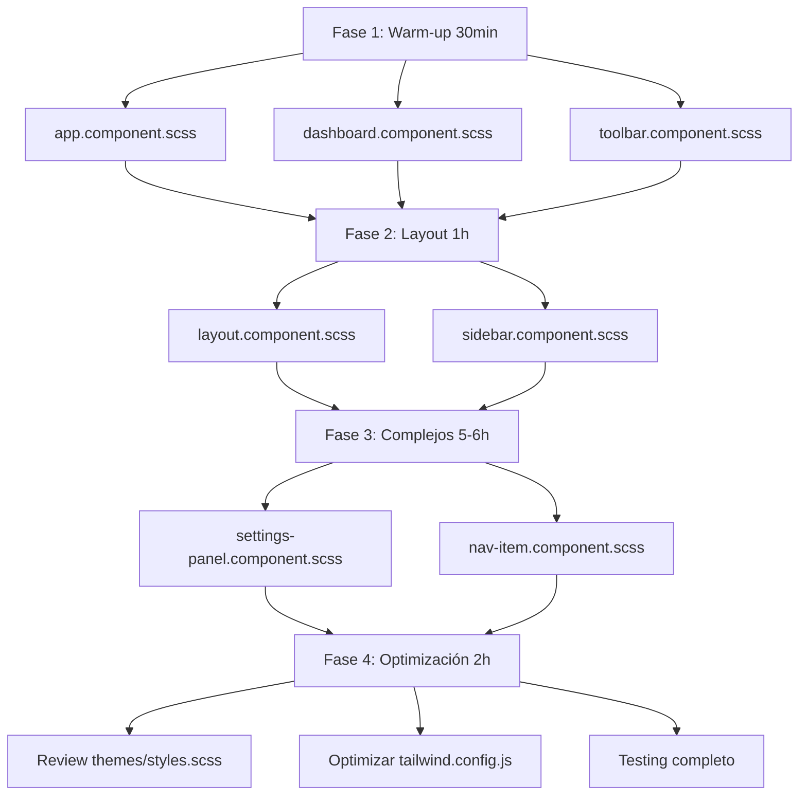

# 📊 Resumen Ejecutivo - Migración Tailwind Utility-First

## 🎯 Objetivo
Reducir el CSS personalizado del proyecto de **~1,100 líneas** a **~200 líneas** (85% de reducción), utilizando principalmente utilities de Tailwind.

## 📈 Estado Actual vs. Objetivo

| Aspecto | Actual | Objetivo | Mejora |
|---------|--------|----------|--------|
| Líneas SCSS custom | ~1,100 | ~200 | -82% |
| Uso de Tailwind | 40% | 90% | +125% |
| Archivos SCSS | 11 | 7 | -4 archivos |
| Mantenibilidad | Media | Alta | ⬆️ |

## 📋 Lista de Archivos a Migrar

### ✅ Eliminación Completa (2 archivos)
- `app.component.scss` (7 líneas) → Migrar a host binding
- `dashboard.component.scss` (18 líneas) → Usar animaciones de Tailwind

### 🔄 Reducción Significativa (5 archivos)
| Archivo | Antes | Después | Reducción |
|---------|-------|---------|-----------|
| `settings-panel.component.scss` | 240 | ~100 | 58% |
| `nav-item.component.scss` | 261 | ~80 | 69% |
| `layout.component.scss` | 32 | ~15 | 53% |
| `toolbar.component.scss` | 10 | ~8 | 20% |
| `sidebar.component.scss` | 38 | ~35 | 8% |

### ⚠️ Mantener (Sistema)
- `themes/styles.scss` (495 líneas) → Revisar y optimizar, pero no migrar
- `styles.scss` (9 líneas) → Mantener como está

## 🚦 Priorización

### P1 - CRÍTICA (debe hacerse primero)
- `nav-item.component.scss` - 261 líneas, componente más complejo
- `settings-panel.component.scss` - 240 líneas, segundo más complejo

### P2 - ALTA
- `layout.component.scss` - 32 líneas, componente base
- `sidebar.component.scss` - 38 líneas, layout principal

### P3 - MEDIA
- `toolbar.component.scss` - 10 líneas
- `dashboard.component.scss` - 18 líneas

### P4 - BAJA
- `app.component.scss` - 7 líneas

## ⏱️ Estimación de Tiempo

| Fase | Componentes | Tiempo Estimado |
|------|-------------|-----------------|
| **Fase 1: Warm-up** | app, dashboard, toolbar | 30 min |
| **Fase 2: Layout** | layout, sidebar | 1 hora |
| **Fase 3: Complejos** | settings-panel, nav-item | 5-6 horas |
| **Fase 4: Optimización** | Review y testing | 2 horas |
| **TOTAL** | | **8-9 horas** |

## ⚠️ Excepciones SCSS Permitidas

Solo mantener SCSS para estos casos:

### ✅ PERMITIDO
1. **Gradientes con variables CSS**
   ```scss
   background: linear-gradient(135deg, var(--theme-primary-600), var(--theme-primary-700));
   ```

2. **Custom scrollbars**
   ```scss
   &::-webkit-scrollbar { width: 6px; }
   ```

3. **Pseudo-elementos complejos**
   ```scss
   &::before { content: ''; position: absolute; ... }
   ```

4. **Animaciones keyframes complejas**
   ```scss
   @keyframes slideIn { ... }
   ```

5. **Transiciones de propiedades específicas**
   ```scss
   transition: width 0.3s cubic-bezier(0.4, 0, 0.2, 1);
   ```

6. **CSS Variables del sistema**
   ```scss
   :root { --theme-primary-500: #3b82f6; }
   ```

### ❌ NO PERMITIDO (migrar a Tailwind)
- Layout básico (flex, grid, padding, margin)
- Colores y tipografía
- Hover/focus states simples
- Spacing y sizing
- Borders y border-radius
- Box shadows
- Transiciones simples (`all`)

## 📝 Patrón de Migración

### Antes (SCSS)
```scss
.nav-item {
  display: flex;
  align-items: center;
  gap: 12px;
  padding: 12px 16px;
  cursor: pointer;
  transition: all 0.2s ease;
  color: rgba(255, 255, 255, 0.7);
  
  &:hover {
    background-color: rgba(255, 255, 255, 0.08);
  }
}
```

### Después (Tailwind)
```html
<div class="flex items-center gap-3 px-4 py-3 cursor-pointer transition-all duration-200 text-white/70 hover:bg-white/10">
```

## 🎯 Comandos Útiles para IA Agent

### Para migrar un componente individual:
```
Migra [NOMBRE_COMPONENTE] a Tailwind utility-first siguiendo las reglas del documento MIGRACION_TAILWIND_UTILITY_FIRST.md sección [NUMERO]. 

Mantén solo:
- Gradientes con CSS variables
- Custom scrollbars
- Pseudo-elementos complejos

Reemplaza todo lo demás con utilities de Tailwind.
```

### Para validar la migración:
```
Revisa [NOMBRE_COMPONENTE] y verifica que:
1. El archivo .scss tiene menos de 50 líneas (o está eliminado)
2. Solo contiene excepciones legítimas
3. El HTML usa principalmente clases de Tailwind
4. Dark mode funciona
5. Responsive funciona
```

## 📚 Documentación Completa

Para instrucciones detalladas paso a paso, ver:
👉 **`MIGRACION_TAILWIND_UTILITY_FIRST.md`**

Este documento contiene:
- ✅ Análisis detallado de cada componente
- ✅ Ejemplos de código antes/después
- ✅ Explicaciones de cada decisión
- ✅ Mejores prácticas
- ✅ Checklist de validación

## 🔄 Orden de Ejecución Recomendado



## ✅ Checklist Rápido

### Antes de empezar
- [ ] Leer `MIGRACION_TAILWIND_UTILITY_FIRST.md` completo
- [ ] Hacer backup o commit del estado actual
- [ ] Entender el sistema de temas (CSS variables)
- [ ] Revisar `tailwind.config.js` actual

### Durante la migración
- [ ] Migrar un componente a la vez
- [ ] Probar visualmente después de cada cambio
- [ ] Verificar dark mode
- [ ] Verificar responsive
- [ ] Hacer commit después de cada componente

### Después de terminar
- [ ] Verificar que el build funciona
- [ ] Comparar bundle size (antes/después)
- [ ] Revisar no hay código CSS duplicado
- [ ] Actualizar documentación si es necesario
- [ ] Celebrar 🎉

## 📞 Soporte

Si tienes dudas durante la migración:

1. Consulta la sección específica del componente en `MIGRACION_TAILWIND_UTILITY_FIRST.md`
2. Revisa la sección "Excepciones Permitidas"
3. Busca en la sección "Mejores Prácticas"
4. Si no está claro, es mejor preguntar antes de continuar

---

**Inicio recomendado:** Fase 1 → `app.component.scss` (5 minutos, fácil, para familiarizarte)
**Mayor impacto:** Fase 3 → `nav-item.component.scss` y `settings-panel.component.scss` (reducción de 401 líneas)

**¡Buena suerte con la migración!** 🚀

