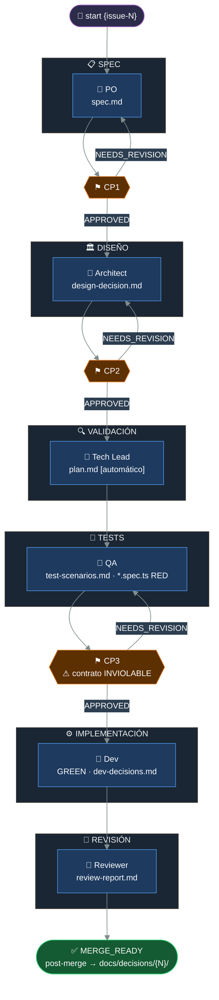
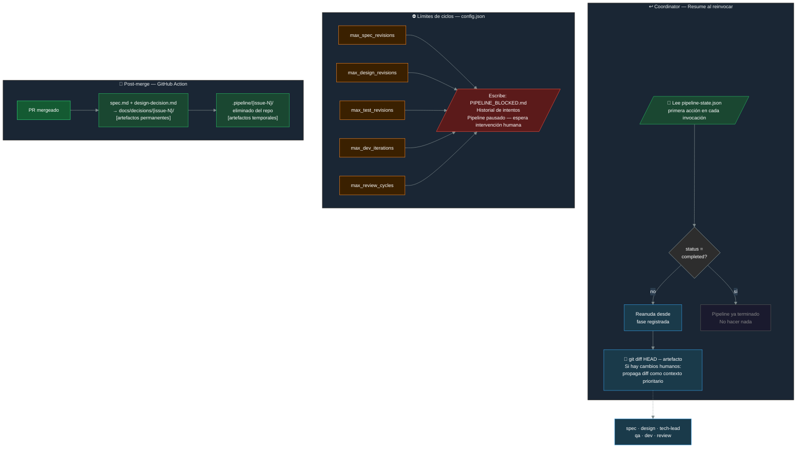

```mermaid
---
id: 360dde89-8036-4f3e-a1c9-58bdcfbaaae9
---
%%{
  init: {
    "theme": "base",
    "themeVariables": {
      "primaryColor": "#1e3a5f",
      "primaryTextColor": "#ffffff",
      "primaryBorderColor": "#4a90d9",
      "lineColor": "#7f8c8d",
      "secondaryColor": "#2c3e50",
      "tertiaryColor": "#1a2634",
      "background": "#0d1b2a",
      "mainBkg": "#1e3a5f",
      "nodeBorder": "#4a90d9",
      "clusterBkg": "#1a2634",
      "titleColor": "#ecf0f1",
      "edgeLabelBackground": "#2c3e50",
      "fontSize": "13px"
    }
  }
}%%

flowchart TD

  START(["🚀 start / resume {issue-N}"])
  READ[/"📂 pipeline-state.json"/]
  ROUTE{Interrumpido?}

  START --> READ --> ROUTE
  ROUTE -->|nuevo| PO_IN
  ROUTE -->|retoma| JMP["↩ Resume"]

  JMP -.->|spec| PO_IN
  JMP -.->|design| ARCH_IN
  JMP -.->|tech-lead| TL_IN
  JMP -.->|qa| QA_IN
  JMP -.->|dev| DEV_IN
  JMP -.->|review| REV_IN

  %% ── FASE 0 ──────────────────────────────────────────────

  subgraph F0["📋  SPEC — PO Agent"]
    PO_IN(( ))
    PO["🤖 PO\nEntrevista → spec.md"]
    PO_V{Schema ok?}
    PO_S[/"✍ spec.md"/]
    PO_IN --> PO --> PO_V
    PO_V -->|no| PO
    PO_V -->|sí| PO_S
  end

  PO_S --> CP1{{"⚑ CP1 — spec.md"}}
  CP1 -->|NEEDS_REVISION| M1{> max?}
  M1 -->|no| PO_IN
  M1 -->|sí| BLOCKED
  CP1 -->|APPROVED| D1["🔀 git diff"]
  D1 --> ARCH_IN

  %% ── FASE 1 ──────────────────────────────────────────────

  subgraph F1["🏛  DISEÑO — Architect Agent"]
    ARCH_IN(( ))
    ARCH["🤖 Architect\nEnfoques + trade-offs\nElementos observables"]
    ARCH_V{Schema ok?}
    ARCH_S[/"✍ design-decision.md"/]
    ARCH_IN --> ARCH --> ARCH_V
    ARCH_V -->|no| ARCH
    ARCH_V -->|sí| ARCH_S
  end

  ARCH_S --> CP2{{"⚑ CP2 — design-decision.md"}}
  CP2 -->|NEEDS_REVISION| M2{> max?}
  M2 -->|no| ARCH_IN
  M2 -->|sí| BLOCKED
  CP2 -->|APPROVED| D2["🔀 git diff"]
  D2 --> TL_IN

  %% ── FASE 2 ──────────────────────────────────────────────

  subgraph F2["🔍  VALIDACIÓN — Tech Lead Agent"]
    TL_IN(( ))
    TL["🤖 Tech Lead [adversarial]\n① caso en CONTRA\n② checklist\n③ veredicto"]
    TL_V{Checklist\ncompleta?}
    TL_S[/"✍ plan.md"/]
    TL_IN --> TL --> TL_V
    TL_V -->|no| TL
    TL_V -->|sí| TL_S
  end

  TL_S --> QA_IN

  %% ── FASE 3 ──────────────────────────────────────────────

  subgraph F3["🧪  TESTS — QA Agent"]
    QA_IN(( ))
    QA["🤖 QA\ntest-scenarios.md\n*.spec.ts en RED"]
    QA_V{Tests fallan\npor assertion?}
    QA_S[/"✍ test-scenarios.md + *.spec.ts"/]
    QA_IN --> QA --> QA_V
    QA_V -->|error setup| QA
    QA_V -->|RED ✓| QA_S
  end

  QA_S --> CP3{{"⚑ CP3 — test-scenarios.md\n⚠ contrato INVIOLABLE"}}
  CP3 -->|NEEDS_REVISION| M3{> max?}
  M3 -->|no| QA_IN
  M3 -->|sí| BLOCKED
  CP3 -->|APPROVED| D3["🔀 git diff"]
  D3 --> DEV_IN

  %% ── FASE 4 ──────────────────────────────────────────────

  subgraph F4["⚙  IMPLEMENTACIÓN — Dev Agent"]
    DEV_IN(( ))
    DEV["🤖 Dev\nImplementa → GREEN\ndev-decisions.md"]
    DEV_R{"test ✅  build ✅  lint ✅"}
    DEV_C{Tipo\nde fallo}
    DEV_QA["SPEC_CONFLICT\nTEST_BUG → QA"]
    DEV_TL["IMPL_BLOCK\n→ Tech Lead"]
    DEV_PO["AMBIGUOUS_REQ\n→ PO"]
    DEV_RV["No clasificable\n→ Reviewer"]
    DEV_M{> max?}
    DEV_S[/"✍ completion-report.md + dev-decisions.md"/]
    DEV_IN --> DEV --> DEV_R
    DEV_R -->|✅| DEV_S
    DEV_R -->|❌| DEV_C
    DEV_C --> DEV_QA
    DEV_C --> DEV_TL
    DEV_C --> DEV_PO
    DEV_C --> DEV_RV
    DEV_QA --> DEV_M
    DEV_TL --> DEV_M
    DEV_PO --> DEV_M
    DEV_RV --> DEV_M
    DEV_M -->|no| DEV
    DEV_M -->|sí| BLOCKED
  end

  DEV_S --> REV_IN

  %% ── FASE 5 ──────────────────────────────────────────────

  subgraph F5["🔎  REVISIÓN — Reviewer Agent"]
    REV_IN(( ))
    REV["🤖 Reviewer\nSOLID · coupling · arch\nBLOQUEANTE / MAYOR / MENOR"]
    REV_V{¿BLOQUEANTE?}
    REV_FIX["Dev corrige\nMAYOR / MENOR"]
    REV_OK[/"✍ review-report.md\nMERGE_READY · completed"/]
    REV_BLK[/"✍ review-report.md\nDO_NOT_MERGE"/]
    REV_CYC{> max?}
    REV_IN --> REV --> REV_V
    REV_V -->|MAYOR/MENOR| REV_FIX
    REV_FIX --> REV
    REV_V -->|no bloqueante| REV_OK
    REV_V -->|BLOQUEANTE| REV_BLK
    REV_BLK --> REV_CYC
    REV_CYC -->|sí| BLOCKED
  end

  REV_OK --> DONE
  REV_BLK --> CP4{{"⚑ CP4 — review-report.md\n[solo si BLOQUEANTE]"}}
  CP4 -->|MERGE_WITH_FIXES| REV_FIX
  CP4 -->|DO_NOT_MERGE| SUS["Tests → @suspended\nRetrocede a FASE 1"]
  SUS --> ARCH_IN

  %% ── TERMINALES ───────────────────────────────────────────

  DONE(["✅ PIPELINE COMPLETADO\npost-merge → docs/decisions/{N}/"])
  BLOCKED(["⛔ PIPELINE BLOQUEADO\nPIPELINE_BLOCKED.md"])

  %% ── ESTILOS ──────────────────────────────────────────────

  classDef agentNode     fill:#1e3a5f,stroke:#4a90d9,color:#fff
  classDef checkpointNode fill:#5c3000,stroke:#e67e22,color:#fff
  classDef stateNode     fill:#1a4731,stroke:#27ae60,color:#fff
  classDef decisionNode  fill:#2d2d2d,stroke:#95a5a6,color:#fff
  classDef doneNode      fill:#145a32,stroke:#2ecc71,color:#fff
  classDef blockedNode   fill:#5b1a1a,stroke:#e74c3c,color:#fff
  classDef diffNode      fill:#1a3a4a,stroke:#3498db,color:#fff
  classDef entryNode     fill:#2c2c4a,stroke:#9b59b6,color:#fff
  classDef phaseIn       fill:#0d1b2a,stroke:#4a90d9,color:#4a90d9
  classDef escaladeNode  fill:#3a2000,stroke:#e67e22,color:#fff

  class PO,ARCH,TL,QA,DEV,REV agentNode
  class CP1,CP2,CP3,CP4 checkpointNode
  class PO_S,ARCH_S,TL_S,QA_S,DEV_S,REV_OK,REV_BLK stateNode
  class ROUTE,PO_V,ARCH_V,TL_V,QA_V,DEV_R,DEV_C,DEV_M,REV_V,REV_CYC,M1,M2,M3 decisionNode
  class DONE doneNode
  class BLOCKED blockedNode
  class D1,D2,D3 diffNode
  class START,JMP entryNode
  class PO_IN,ARCH_IN,TL_IN,QA_IN,DEV_IN,REV_IN phaseIn
  class DEV_QA,DEV_TL,DEV_PO,DEV_RV,SUS,REV_FIX escaladeNode
```

# Workflow SDD + TDD Multi-Agente — Pipeline

> Documentación completa de las decisiones de diseño: `wip/IA-Summary.md §7.7`
>
> Regenerar: `npm run diagram:all`  ·  Archivos fuente: `wip/pipeline-d*.mmd`

---

## Diagrama 1 — Happy Path

> Flujo nominal completo. Los bucles NEEDS_REVISION son los únicos retrocesos esperados.



---

## Diagrama 2 — Excepciones y escaladas

> Qué ocurre cuando el Dev no puede avanzar o el Reviewer detecta un BLOQUEANTE.

```mermaid
%%{
  init: {
    "theme": "base",
    "themeVariables": {
      "primaryColor": "#1e3a5f",
      "primaryTextColor": "#ffffff",
      "primaryBorderColor": "#4a90d9",
      "lineColor": "#7f8c8d",
      "clusterBkg": "#1a2634",
      "titleColor": "#ecf0f1",
      "edgeLabelBackground": "#2c3e50",
      "fontSize": "13px"
    }
  }
}%%

flowchart TD

  %% ── DEV ESCALATION ──────────────────────────────────────

  subgraph ESC["⚙  Dev — Árbol de escalada"]
    DEV_FAIL["❌ Dev no puede avanzar\nescribe dev-assessment.md"]
    CLASSIFY{Tipo de fallo}

    QA_ESC["→ 🤖 QA\nSPEC_CONFLICT / TEST_BUG"]
    TL_ESC["→ 🤖 Tech Lead\nIMPL_BLOCK"]
    PO_ESC["→ 🤖 PO\nAMBIGUOUS_REQ"]
    RV_ARB["→ 🤖 Reviewer [árbitro]\nno clasificable"]

    DEV_RESUME["Dev retoma con contexto resuelto"]

    DEV_FAIL  --> CLASSIFY
    CLASSIFY  --> QA_ESC
    CLASSIFY  --> TL_ESC
    CLASSIFY  --> PO_ESC
    CLASSIFY  --> RV_ARB
    QA_ESC    --> DEV_RESUME
    TL_ESC    --> DEV_RESUME
    PO_ESC    --> DEV_RESUME
    RV_ARB    --> DEV_RESUME
  end

  %% ── REVIEWER BLOQUEANTE ──────────────────────────────────

  subgraph BLOQ["🔎  Reviewer — Hallazgos"]
    REV_IN["Reviewer emite hallazgos"]
    REV_TYPE{Severidad}

    FIX_MENOR["Dev corrige MAYOR / MENOR\nsin retroceder fase\n→ Reviewer revisa de nuevo"]

    CP4{{"⚑ CP4  [solo si BLOQUEANTE]\nreview-report.md"}}

    FIX_CP4["Dev corrige según\nMERGE_WITH_FIXES"]

    SUSPEND["Tests → @suspended\nCoordinator retrocede\na FASE 1 — Architect rediseña"]

    REV_IN    --> REV_TYPE
    REV_TYPE  -->|MAYOR / MENOR| FIX_MENOR
    REV_TYPE  -->|BLOQUEANTE| CP4
    CP4       -->|MERGE_WITH_FIXES| FIX_CP4
    CP4       -->|DO_NOT_MERGE| SUSPEND
  end

  classDef agentNode    fill:#1e3a5f,stroke:#4a90d9,color:#fff
  classDef escaladeNode fill:#3a2000,stroke:#e67e22,color:#fff
  classDef checkpointNode fill:#5c3000,stroke:#e67e22,color:#fff
  classDef decisionNode fill:#2d2d2d,stroke:#95a5a6,color:#fff
  classDef blockedNode  fill:#5b1a1a,stroke:#e74c3c,color:#fff
  classDef resumeNode   fill:#1a4731,stroke:#27ae60,color:#fff

  class DEV_FAIL,REV_IN agentNode
  class QA_ESC,TL_ESC,PO_ESC,RV_ARB escaladeNode
  class CP4 checkpointNode
  class CLASSIFY,REV_TYPE decisionNode
  class SUSPEND blockedNode
  class DEV_RESUME,FIX_MENOR,FIX_CP4 resumeNode
```



---

## Diagrama 3 — Resiliencia del coordinator

> Cómo el coordinator sobrevive interrupciones, gestiona límites de ciclos y archiva artefactos post-merge.



---

## Leyenda de nodos

| Color / estilo | Significado |
|---|---|
| 🟦 Azul oscuro | Agente especialista (PO / Architect / Tech Lead / QA / Dev / Reviewer) |
| 🟠 Naranja | Checkpoint de aprobación humana |
| 🟢 Verde oscuro | Escritura de artefacto / actualización de estado |
| 🟡 Amarillo | Pausa del coordinator (waiting-for-approval) |
| ⬛ Gris | Nodo de decisión del coordinator |
| 🔵 Azul claro | Detección de cambios humanos (git diff) |
| 🟢 Verde brillante | Pipeline completado |
| 🔴 Rojo | Pipeline bloqueado |

---

## Artefactos por fase

| Fase | Agente | Lee | Escribe |
|---|---|---|---|
| 0 — SPEC | PO Agent | Input humano + templates | `spec.md` |
| 1 — DISEÑO | Architect Agent | `spec.md` | `design-decision.md` |
| 2 — VALIDACIÓN | Tech Lead Agent | `spec.md` + `design-decision.md` + instruction files | `plan.md` |
| 3 — TESTS | QA Agent | `spec.md` + `design-decision.md` | `test-scenarios.md` + `*.spec.ts` |
| 4 — IMPLEMENTACIÓN | Dev Agent | `design-decision.md` + `test-scenarios.md` + `*.spec.ts` | `completion-report.md` + `dev-decisions.md` |
| 5 — REVISIÓN | Reviewer Agent | `design-decision.md` + `completion-report.md` + `dev-decisions.md` | `review-report.md` |
| Coordinator | — | `pipeline-state.json` | `pipeline-state.json` + `PIPELINE.md` + `waiting-for-approval.md` |

---

## Señal de aprobación humana

La aprobación se comunica añadiendo como **primera línea** del artefacto revisado:

```
<!-- STATUS: APPROVED -->
<!-- STATUS: APPROVED_WITH_CHANGES -->
<!-- STATUS: NEEDS_REVISION: {motivo} -->
```

El coordinator parsea esta línea al reanudar. Sin la marca, el pipeline no avanza.

---

## Comandos

```bash
# Regenerar SVG tras modificar el diagrama fuente
npm run diagram:pipeline

# Generar PNG de alta resolución
npm run diagram:pipeline:png
```


